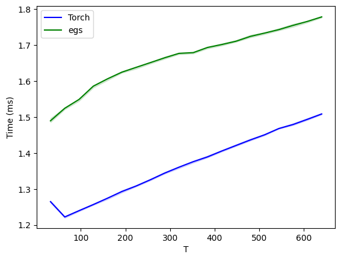

# ExpertGatherScatter (egs)

ExpertGatherScatter (egs) is a high-performance Triton kernel with Torch interface that fuses gather (and scatter) operations with a linear transformation. It is particularly effective in sparse computation settings, like in fine-grained Mixture-of-Experts (MoE) architectures.

## Overview

Let's say X is a tensor of shape [B,T,I] (representing batched sequence of vectors), W_g is a tensor of shape [E,I,J] that represents E expert weights and Ind is a tensor [B,E,K] of elements from {0,..T-1} that describes a routing to the experts for given batch element. 

ExpertGather computes a gathering of the elements described by Ind from X with simultaneous transformation by W_g. The output is a tensor Y of shape [B, E, K, J], where for each element from the batch, for each expert e, K selected tokens are transformed by W_g[e].


This can be implemented in torch for example as follows
```python

def gather(self, X, ind):
    B, T, I = X.shape
    _, E, K = ind.shape

    index=ind.reshape(B, E*K)[...,None].expand(-1,-1,I)
    X_gathered = torch.gather(X, dim=1, index=index).reshape(B, E, K, I)
    Y = torch.einsum('beki, eij->bekj', X_gathered, self.W)
    return Y
def scatter(self, Y, Ind, T):
    B, E, K, J = Y.shape

    X_prescatter = torch.einsum('bekj, eji->beki', Y, self.W)

    I = X_prescatter.shape[-1]
    scattered = torch.zeros(B, T, I, device=Y.device, dtype=Y.dtype)
    Ind = Ind[..., None].expand(-1,-1,-1,I)
    scattered.scatter_add_(1, Ind.reshape(B, E*K, I), X_prescatter.reshape(B, E*K, I))
    return scattered
    
```

Currently, `egs` offers a tradeoff in comparison to the optimised version in pure pytorch, for a slower processing time it offers lower memory requirements. Further optimisation to get both better wall-clock time and memory at the same time is in the backlog.

## Benchmarking

All experiments shown here can be run in `test_speed.ipynb`

different torch baselines are implemented in `egs/baselines.py`

Default benchmark parameters:
```
E = 32 # Number of experts
T = 256 # Sequence length
K = 32 # Number of tokens to process by each expert
B = 64 # Batch size
J = 64 # Number of dimensions for the output of gather and input of scatter
I = 128 # Number of dimensions for the input of gather and output of scatter
```

Benchmarks are measuring the performance of gather, as scather uses exactly the same 3 kernels. Analogous benchmarks for scatter can be computed in `test_speed.ipynb`

### Scaling with T

#### Time



#### Memory


### Scaling with E

#### Time


#### Memory


### Scaling with B

#### Time


#### Memory


### Scaling with I

#### Time


#### Memory

